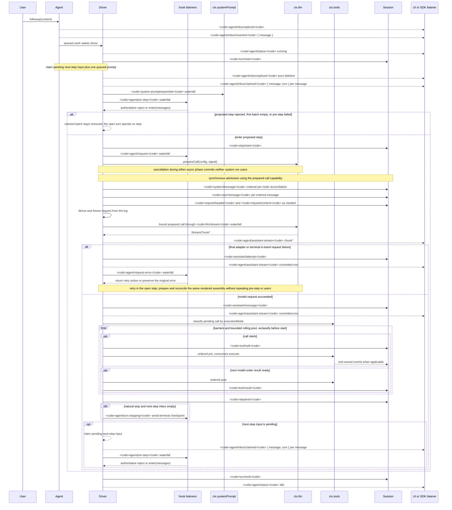

<!-- 英文源文件由 scripts/gen-doc-graphs.ts 生成；本中文文件是通过双语配对维护的经评审对侧。
     更新时先运行 `pnpm run gen-doc-graphs` 更新英文，再更新本文件并运行 `pnpm run verify-translation-pairing --write docs/agent-lifecycle.md` 重新记录配对。 -->

# Agent 轮次与步骤生命周期

[English](agent-lifecycle.md) | 中文

此时序图是 [architecture.md](architecture.zh.md#turn-flow) 的配套图示。持久的回放事实保存在 `session/event` 中，实时控制与状态则保存在 `agent/*` 中。

`assistant/message` 事件会记录每次成功的提供方调用，包括返回空内容或以 `max-tokens` 结束的调用，并嵌入精确的紧凑带时间 stream。空内容不会进入派生历史。失败、重试、取消或 stream error attempt 到达 settlement 时，如果没有 surface message，就会把 stream 记录为 `assistant/attempt`。实时 `agent/assistant-stream` chunk frame 是瞬态数据；回放读取任一种持久 settlement，如果进程在 settlement 前硬中断，则不会留下持久 attempt stream。

`dsh-compaction-basic` 在派生请求之前通过 `agent/pre-step` 处理压力，而 `agent/request-error` 仅用于规范的上下文溢出。任一触发条件满足后，系统都会先执行可选的工具结果剪枝，再选择摘要。恢复发生在仍打开的步骤内，只有剪枝或摘要生成推进 surface replacement generation 时才重试，否则仍以原始请求错误为准。每次重试都会准备调用，并在派生请求之前协调保留的已渲染组装结果，不重复组装、pre-step 或用户消息准入。

以返回的 `agent/pre-step` 决策为准；通过包装 `next()` 的监听器会保留下游消息与 `startsRequestSeries`，除非有意替换。steering（中途引导）和注入的上下文在后续的认领操作取得其下一步骤批次后，会经过同一 waterfall（瀑布式事件）。

需要可回放 transcript（文本记录）数据的 SDK 用户应当消费 `session/event`；`agent/*` 是用于队列与状态、提示词拦截、请求构造、steering、继续执行和错误处理的实时协调接口。

维护模式：英文源文件包含人工维护的 Mermaid 时序图，并由生成器写出；本中文文件作为经评审对侧通过双语配对维护。确切的事件签名位于生成的 Cordis 目录中。
